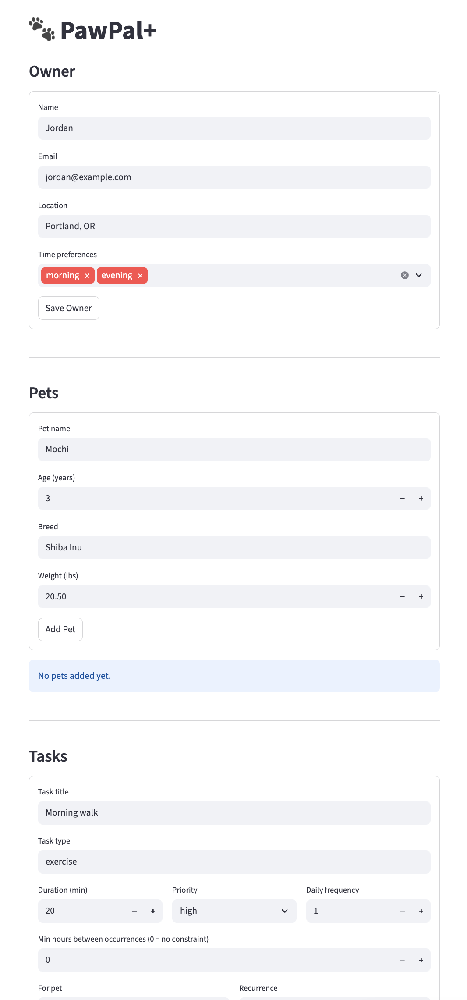

# PawPal+ (Module 2 Project)

You are building **PawPal+**, a Streamlit app that helps a pet owner plan care tasks for their pet.

## Scenario

A busy pet owner needs help staying consistent with pet care. They want an assistant that can:

- Track pet care tasks (walks, feeding, meds, enrichment, grooming, etc.)
- Consider constraints (time available, priority, owner preferences)
- Produce a daily plan and explain why it chose that plan

Your job is to design the system first (UML), then implement the logic in Python, then connect it to the Streamlit UI.

## What you will build

Your final app should:

- Let a user enter basic owner + pet info
- Let a user add/edit tasks (duration + priority at minimum)
- Generate a daily schedule/plan based on constraints and priorities
- Display the plan clearly (and ideally explain the reasoning)
- Include tests for the most important scheduling behaviors

## Features

| Feature | Algorithm / Method | What it does |
|---|---|---|
| **Greedy scheduling** | `Scheduler.generate_schedule()` | Fits tasks into free time windows in priority order using a first-fit greedy pass; consumed slots are subtracted from the available pool so no two tasks can share the same time. |
| **Priority-aware ordering** | `PRIORITY_ORDER` sort key | Tasks are sorted high → medium → low before placement so critical care (medication, feeding) is guaranteed a slot before lower-priority items compete for remaining time. |
| **Pet clustering** | Composite sort key | Within the same priority tier, tasks are grouped by pet name so the owner's attention stays on one animal before moving to the next. |
| **Even spacing** | Spare-time interval formula | Recurring tasks (`daily_frequency > 1`) with no explicit gap constraint are automatically spread across the day by computing `spare_time ÷ (slots − 1)` as the minimum interval, rather than stacking all occurrences at the start. |
| **Busy period avoidance** | `free_windows_for(day)` | Owner-defined busy blocks (e.g. work hours) are subtracted from the scheduling window per day; only the remaining free windows are offered to the task placer. |
| **Sorting by time** | `Task.__lt__()` | Tasks implement Python's less-than operator based on `scheduled_time`, making any list of placed tasks sortable with the built-in `sorted()`. Unscheduled tasks sort last. |
| **Daily recurrence** | `Task.mark_complete()` return value | Marking a `daily` task complete returns a fresh `Task` instance with `next_due = today + 1 day`, `is_complete = False`, and `scheduled_time` cleared so the scheduler can place it fresh the next day. |
| **Weekly recurrence** | `Task.mark_complete()` return value | Same as daily recurrence but `next_due` advances by 7 days. |
| **Conflict detection** | `Scheduler.detect_conflicts(tasks)` | Checks every pair of tasks using the standard interval-overlap test (`a_start < b_end and b_start < a_end`) and returns a human-readable warning string for each conflict. Runs automatically at the end of `generate_schedule()` and is stored on the `Schedule` object. |
| **Task filtering** | `Schedule.filter_tasks(is_complete, pet_name)` | Returns a subset of scheduled tasks matching any combination of completion status and pet name; both filters are optional and can be applied together. |
| **Duplicate prevention** | Existence check in `app.py` | Before creating a new task the UI checks whether a task with the same name and pet already exists in the session, and shows a warning instead of adding a duplicate. |
| **Scheduling reasoning** | `Schedule.generate_reasoning_text()` | Every placement and skip decision is recorded as a plain-English line during the greedy pass and surfaced to the user in a collapsible expander. |

## Smarter Scheduling

The scheduler has been extended with several features beyond the baseline:

**Priority-aware, pet-clustered ordering** — tasks are sorted high → medium → low priority, and tasks belonging to the same pet are grouped together so a pet owner's attention isn't split between animals mid-schedule.

**Even spacing for recurring tasks** — tasks with a `daily_frequency` greater than 1 (e.g. feeding twice a day) are automatically spread evenly across the available window rather than stacked at the earliest possible times.

**Recurrence** — tasks can be marked `daily` or `weekly`. Calling `mark_complete()` on a recurring task automatically returns a fresh instance for the next occurrence with `next_due` set forward by 1 or 7 days.

**Conflict detection** — `Scheduler.detect_conflicts(tasks)` checks any list of scheduled tasks for overlapping time intervals and returns human-readable warning strings. The same check runs automatically at the end of `generate_schedule()` and is stored on the returned `Schedule` object.

**Task filtering and sorting** — `Schedule.filter_tasks(is_complete=..., pet_name=...)` returns a filtered subset of scheduled tasks. Tasks are also sortable by scheduled time via the standard `sorted()` built-in (`Task` implements `__lt__`).

**Duplicate prevention** — the UI blocks adding a task with the same name and pet as one that already exists.

## Testing PawPal+

### Running the tests

```bash
python -m pytest tests/test_pawpal.py -v
```

### What the tests cover

The suite contains 23 tests across three areas:

- **Sorting** — verifies that tasks with a `scheduled_time` sort chronologically, that tasks without a time always fall last, and that after `generate_schedule` the placed tasks are ordered correctly.
- **Recurrence** — confirms that marking a `daily` task complete returns a new task due tomorrow, a `weekly` task returns one due in 7 days, the spawned task starts incomplete with no scheduled time, and non-recurring tasks return `None`.
- **Conflict detection** — checks that overlapping time intervals are flagged with both task and pet names, that back-to-back tasks (touching but not overlapping) are not flagged, and that tasks with no `scheduled_time` are safely skipped.

### Confidence level

★★★★☆ (4/5)

The core scheduling logic, recurrence, sorting, and conflict detection are all tested and passing. The main gap is the Streamlit UI layer (`app.py`), which is not covered by automated tests — session state behavior, form submission, and rerun triggers can only be verified manually. A fifth star would require UI-level integration tests or end-to-end browser tests.

## Getting started

### Setup

```bash
python -m venv .venv
source .venv/bin/activate  # Windows: .venv\Scripts\activate
pip install -r requirements.txt
```

### Suggested workflow

1. Read the scenario carefully and identify requirements and edge cases.
2. Draft a UML diagram (classes, attributes, methods, relationships).
3. Convert UML into Python class stubs (no logic yet).
4. Implement scheduling logic in small increments.
5. Add tests to verify key behaviors.
6. Connect your logic to the Streamlit UI in `app.py`.
7. Refine UML so it matches what you actually built.

## 📸 Demo

<a href="PawPal+.png" target="_blank"></a>.
