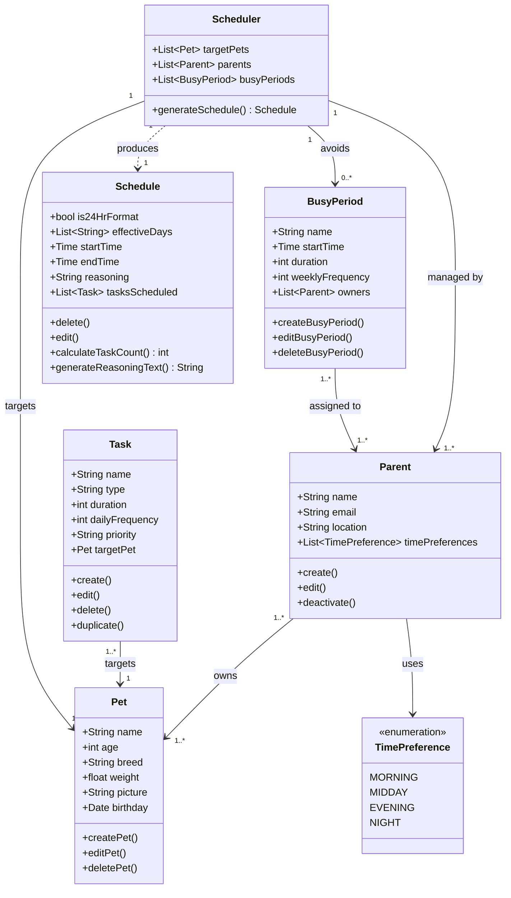

# PawPal+ UML Class Diagram

```mermaid
classDiagram
    direction TB

    class TimePreference {
        <<enumeration>>
        MORNING
        MIDDAY
        EVENING
        NIGHT
    }

    class Parent {
        +String name
        +String email
        +String location
        +List~TimePreference~ timePreferences
        +create()
        +edit()
        +deactivate()
    }

    class Pet {
        +String name
        +int age
        +String breed
        +float weight
        +String picture
        +Date birthday
        +createPet()
        +editPet()
        +deletePet()
    }

    class Task {
        +String name
        +String type
        +int duration
        +int dailyFrequency
        +String priority
        +Pet targetPet
        +create()
        +edit()
        +delete()
        +duplicate()
    }

    class BusyPeriod {
        +String name
        +Time startTime
        +int duration
        +int weeklyFrequency
        +List~Parent~ owners
        +createBusyPeriod()
        +editBusyPeriod()
        +deleteBusyPeriod()
    }

    class Scheduler {
        +List~Pet~ targetPets
        +List~Parent~ parents
        +List~BusyPeriod~ busyPeriods
        +generateSchedule() Schedule
    }

    class Schedule {
        +bool is24HrFormat
        +List~String~ effectiveDays
        +Time startTime
        +Time endTime
        +String reasoning
        +List~Task~ tasksScheduled
        +delete()
        +edit()
        +calculateTaskCount() int
        +generateReasoningText() String
    }

    Parent --> TimePreference : uses
    Parent "1..*" --> "1..*" Pet : owns
    Task "1..*" --> "1" Pet : targets
    Scheduler "1" --> "1..*" Pet : targets
    Scheduler "1" --> "1..*" Parent : managed by
    Scheduler "1" --> "0..*" BusyPeriod : avoids
    Scheduler "1" ..> "1" Schedule : produces
    BusyPeriod "1..*" --> "1..*" Parent : assigned to
```
